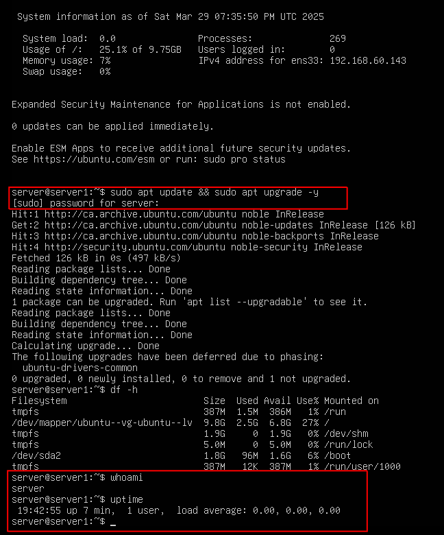

## Task 1: Inital set up and a few basic CLI commands

Note in the screen shot that I highlighted the few commands. The update and upgrade commands where shown for the example as I actually ran those before I remembered to take the screenshot. 

### Screenshot: System Install and logged in

