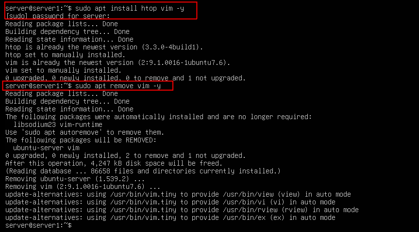
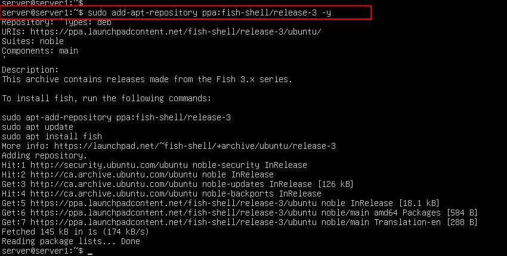
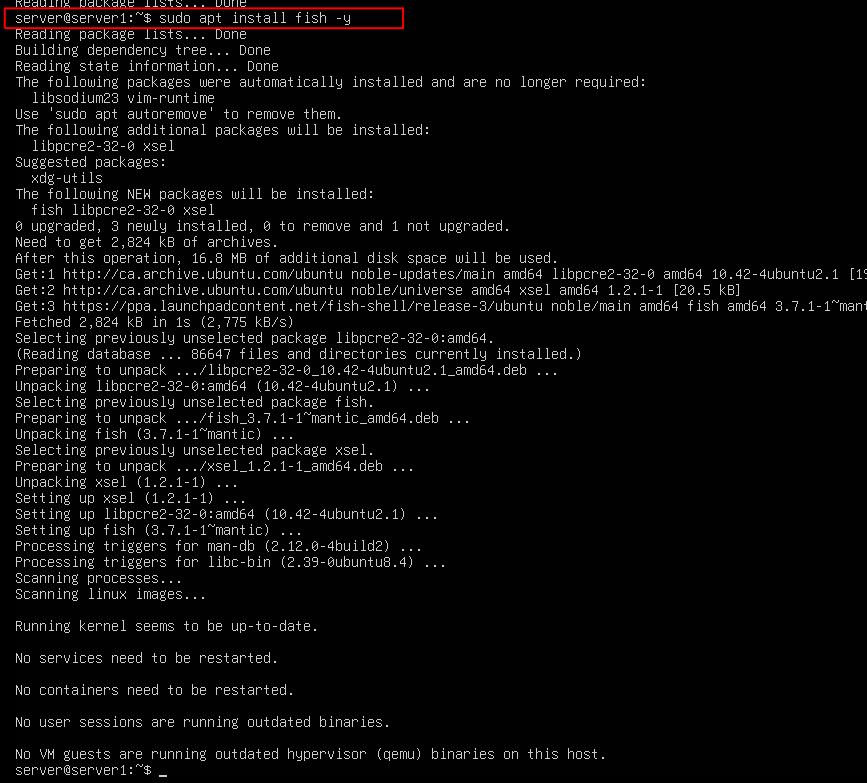

## Task 2 - Managing Packages and Repositories

This step covers basic package management: installing, removing, and adding third-party repositories.  
In this case, I installed and removed some common utilities, and added the Fish Shell repository as a real-world example of pulling from outside the default Ubuntu repos.

### Screenshot 1: Installing packages using APT (Advanced Package Tool – standard on Debian-based systems) 

### Screenshots: Adding and installing from a third-party repository (Fish Shell)

> This approach is used when an application has dependencies or versions not bundled with the default OS packages.

