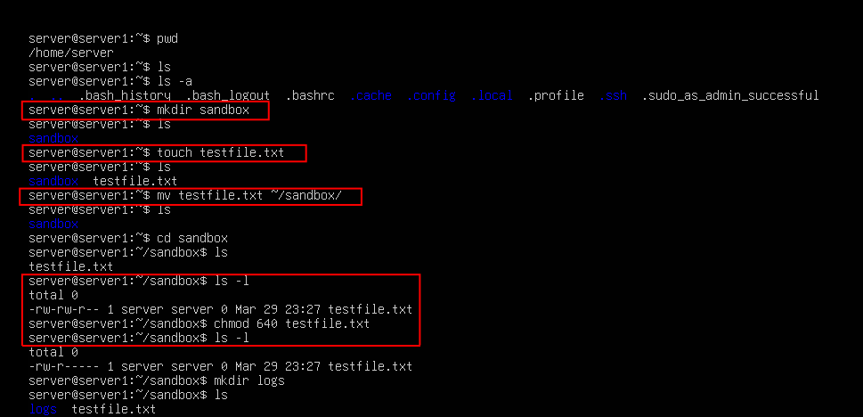
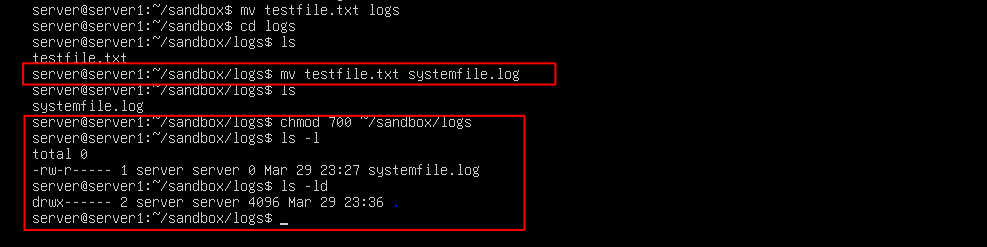

## Task 3 - File System Navigation and Permissions

For this task I practiced with creating files and folders in the CLI. Followed up by creating a sub folder, moving and renaming a file,
finally changing permissions on the file and the folder. 

### Common Commands Used

- `mkdir <directory name>` -- creates an empty folder
- `touch <file name>` -- creates an empty file
- `ls -l` -- lists the files in the current folder and the permissions 
- `ls -d` -- list the permission of the folder(directory)

---
You can find a good explanation of the **permission string format** (e.g. `-rw-r--r--`) here:
👉 [https://www.redhat.com/sysadmin/linux-file-permissions](https://www.redhat.com/en/blog/linux-file-permissions-explained)

And a guide to **numeric permission codes** (like `chmod 640`) here:  
👉 [https://chmodcommand.com](https://chmodcommand.com)

---

### Screenshots

