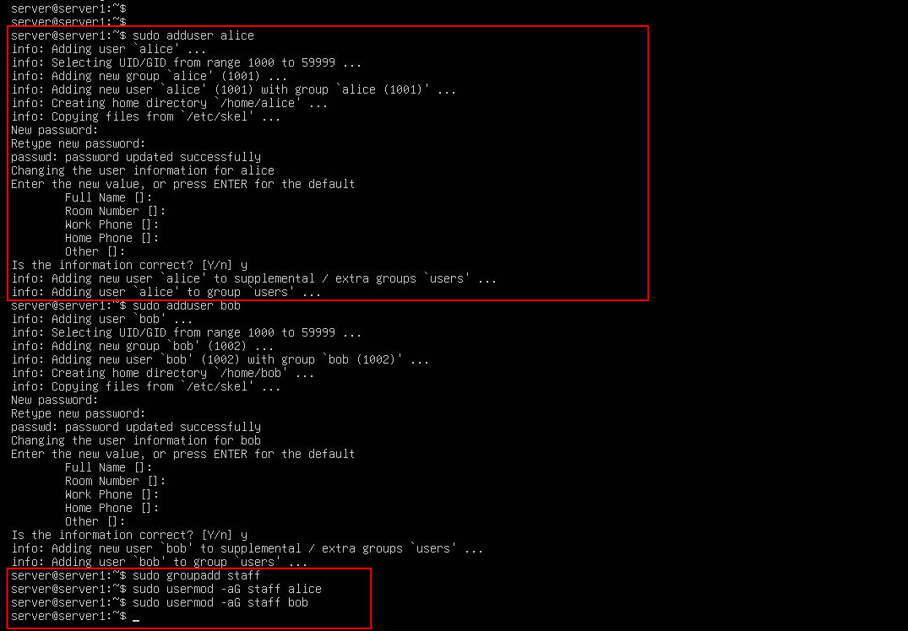
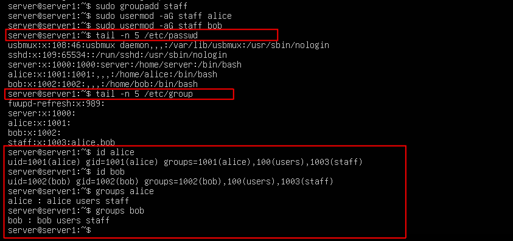

## Task 4 – User and Group Management

In this task, I explored how to manage users and groups on a Linux system. This is a critical part of system administration, as it allows for proper access control and user role organization.

I created two users (`alice` and `bob`), added them to a new group called `staff`, verified group membership, and then removed everything as a final cleanup step.

---

### 📦 Commands Used

- `adduser` – Adds a new user and creates their home directory
- `groupadd` – Creates a new group
- `usermod -aG` – Appends a user to an existing group
- `cat /etc/passwd` – Lists all users on the system
- `cat /etc/group` – Lists all groups and their members
- `id <user>` / `groups <user>` – Verifies group membership
- `deluser --remove-home` – Deletes a user and their home directory
- `groupdel` – Deletes a group

---

### 🖼️ Screenshots

#### ✅ Creating users and assigning them to a new group
This shows the creation of `alice` and `bob`, along with the new `staff` group. We added both users to this group using `usermod`.

---

#### 🔍 Verifying user and group membership
Used `tail` to show the most recent entries in `/etc/passwd` and `/etc/group`. Also used `id` and `groups` to verify that `alice` and `bob` were members of `staff`.

---

#### 🧹 Cleanup: Removing users and group
Fully removed `alice`, `bob`, and the `staff` group using `deluser` and `groupdel`. Always a good idea to know how to undo what you’ve built.

---

