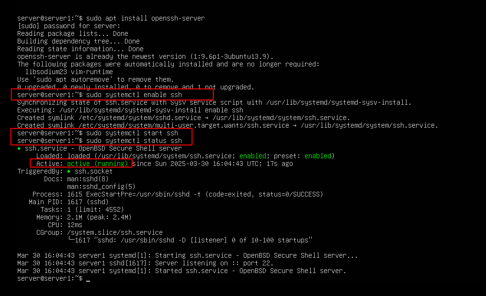

## Task 5 – SSH Setup for Remote Access

In this task, I installed and configured the **OpenSSH server** to allow remote access to the Ubuntu Server. SSH (Secure Shell) is an essential tool for system administrators—it allows for secure remote management of systems over a network.

---

### 📦 Commands Used

- `sudo apt install openssh-server`  
  Installs the OpenSSH service package if it's not already installed.

- `sudo systemctl enable ssh`  
  Configures the SSH service to start automatically at boot.

- `sudo systemctl start ssh`  
  Starts the SSH service immediately.

- `sudo systemctl status ssh`  
  Verifies that the SSH service is running (`active (running)` = success).

---

### 🔐 Network Context

> **Note:**  
> For this lab, I'm **not using a live internet-facing connection**. The final setup will be a **closed, internal network**, so there's no need to access this system externally over SSH.

> A future project will explore placing a hardened server on the public internet with a network behind it. But that’s whole different side quest. Stay tuned... 

---

### 🖼️ Screenshot

#### ✅ Installing and Starting OpenSSH
This screenshot shows the installation and setup of the SSH service, with confirmation that it is active and running.

