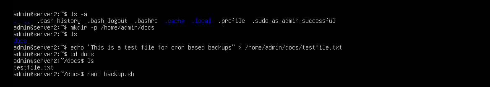
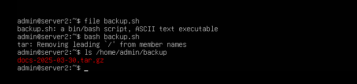

## Task 6 - Automating Backups with Cron and Bash

In this task, I created a simple automated backup system using a Bash script and scheduled it to run daily using `cron`.

I worked on `server2` to:
- Create a folder named `docs` with a test file.
- Write a Bash script that compresses the `docs` folder into a timestamped `.tar.gz` archive.
- Schedule that script to run every day at 2 AM via `cron`.

---

### 🛠️ Bash Script: `backup.sh`

This script does two things:
1. Creates a `/home/admin/backup` directory if it doesn't already exist.
2. Compresses the `/home/admin/docs` folder into a `.tar.gz` file with the current date in the filename.

📸 `backupscript.png`  


---

### 📁 Create Source Directory and Test File

I created a `docs` folder and added a simple text file to simulate backup content.

📸 `createdocs.png`  


---

### 🧪 Attempt #1: Run the Script (spoiler: it didn't work)

Despite being executable and visibly present… the script threw a bizarre `file not found` error. Cue Linux sorcery. 🔮

📸 `hidden.png`  


---

### 🔎 Investigation: The Mystery Bug 🕵️

This is where things got weird.

I wrote the script *manually* in `nano` on the server itself — no copy/pasting, no external editing — and still received a “file not found” error when trying to run it using `./backup.sh`.

The typical cause for this is a `^M` carriage return character (from Windows-style line endings), especially after the `#!/bin/bash` line — but in this case, we couldn't confirm that was present. We ran `cat -v` and `file backup.sh` and things *looked* normal.

So, the true cause is still unknown — possibly some kind of encoding or terminal quirk. The important thing is…

📸 `convert2unix.png`  
📸 `dos2unix.png`

---

### 🔧 Internet Workaround for `dos2unix`

Naturally, `server2` had no internet access because it was on a private, isolated lab network.  
To install `dos2unix`, we had to:

1. Edit `/etc/netplan/50-cloud-init.yaml`
2. Switch from static IP to DHCP
3. Change the VM to use NAT
4. Install the package
5. Switch everything back

📸 `dos2unix.png`

…and after all that, it still didn’t fix the issue.

---

### 💡 Final Fix: Just Use Bash

After a few choice words and some tactical pacing, I got the script working by simply running:

```bash
bash backup.sh` instead of `./backup.sh

```

---

📸 `finally.png`  


This bypasses whatever mysterious execution problem existed and directly calls the interpreter. Sometimes it’s not worth finding the ghost — just use holy water and move on.

---

### 💥 Bonus: Automating with Cron

Once we verified the script worked, we added it to the crontab for the `admin` user.

We used this:
0 2 * * * /home/admin/backup.sh

📸 `createcron.png`  
📸 `nanocron.png`  
📸 `confirmcron.png`

---

### 🔚 Summary

✅ Created a working backup system using Bash and cron  
✅ Encountered a strange execution issue — probably encoding-related, but unconfirmed  
✅ Installed `dos2unix`, updated network settings, still had to fallback to `bash backup.sh`  
✅ Got everything running and verified that backups are being created correctly  
✅ Left a small offering to the shell gods in thanks

---

> 💬 Lesson learned: Sometimes it’s not your code — it’s hidden ghosts from the system or terminal environment. Be suspicious of everything, especially when the error makes no sense.
