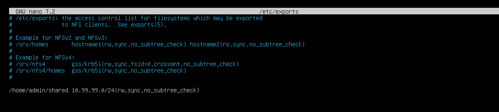
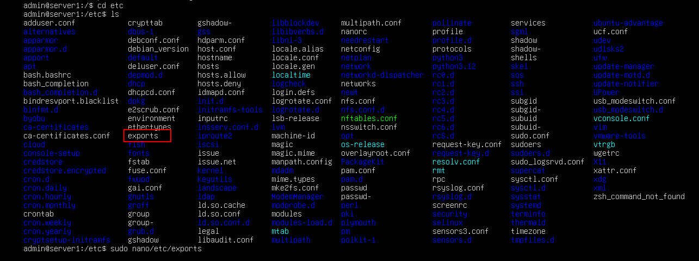
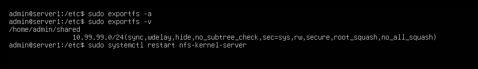
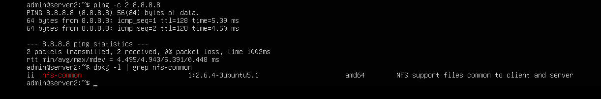

### Task 7 – Sharing Files Between Linux Servers with NFS

In this task, I set up **Network File Sharing (NFS)** between two machines in the lab:  
- `server1` acts as the **NFS server**, hosting a shared folder  
- `server2` acts as the **NFS client**, mounting that folder for remote access

NFS is a lightweight, fast, and native Linux protocol that allows directories to be shared over a network as if they were local.

---

## ⚙️ The What

- Installed required NFS packages on both machines
- Created a shared directory on `server1`
- Configured `/etc/exports` for access
- Verified the export and restarted the NFS service
- Confirmed `nfs-common` was installed on `server2`

---

### 🖥️ On server1 (NFS Server)

## ✅ Install NFS server package:

```bash
sudo apt update && sudo apt install -y nfs-kernel-server

```

---

📂 Create a shared directory
```bash
mkdir -p /home/admin/shared
echo "This is from server1" > /home/admin/shared/readme.txt

```


---

🛠️ Configure NFS exports

```bash
sudo nano /etc/exports
```

Add this line to the bottom of the file:

```bash
/home/admin/shared 10.99.99.0/24(rw,sync,no_subtree_check)
```



---

🧠 Apply export rules and confirm

```bash
sudo exportfs -a
sudo exportfs -v
```



---

🔁 Restart NFS server

```bash
sudo systemctl restart nfs-kernel-server
```



---

### 🖥️ On server2 (NFS Client)

## ✅ Install NFS client package

```bash
sudo apt install nfs-common
```

> ! I missed the screenshot for the install command but you can see the confirmation of the install in the pic below



---
