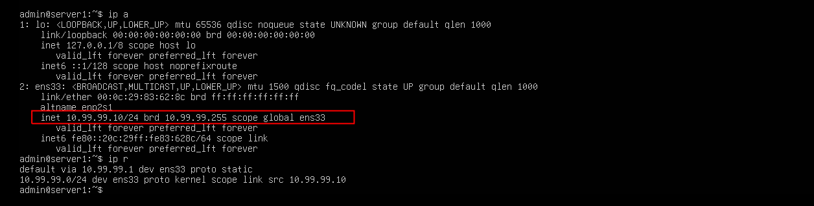
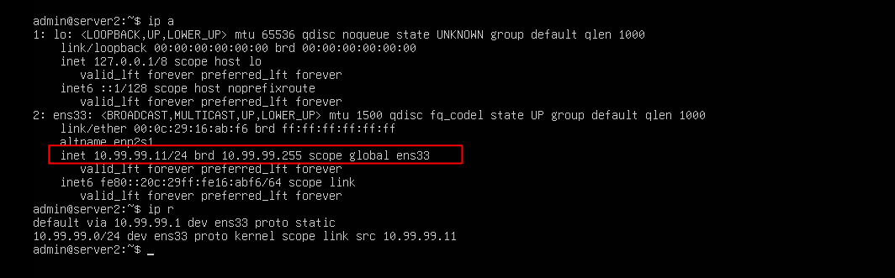
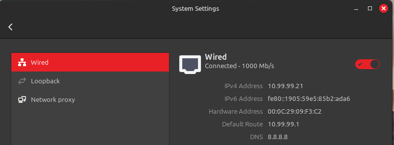
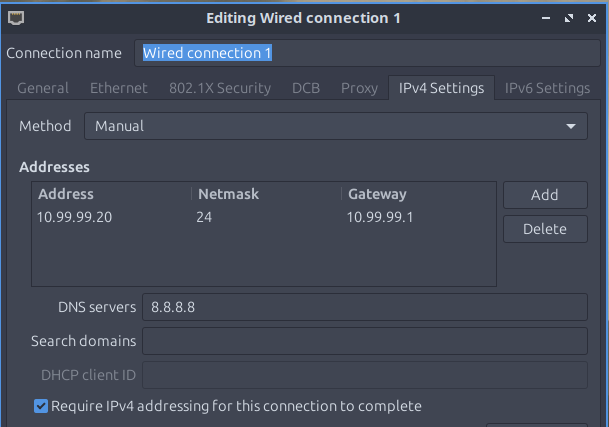

## Task 9 – Building the Network Lab Machines

In this task, I built out the rest of my virtual lab environment by deploying three additional machines. These will form the foundation for the rest of the lab exercises ahead.

This task involved:

- Deploying multiple Linux-based virtual machines
- Assigning static IP addresses
- Connecting all machines to a private, isolated network (vmnet99)
- Verifying proper addressing via `ip a` and `ip r`

---

### Lab Machine Overview

- **Server1** – Ubuntu Server 22.04  
  IP: `10.99.99.10`

- **Server2** – Ubuntu Server 22.04  
  IP: `10.99.99.11`

- **Mint** – Linux Mint desktop (for GUI-based tasks)  
  IP: `10.99.99.20`

- **Lubuntu** – Lightweight Lubuntu desktop (for variety and resource efficiency)  
  IP: `10.99.99.21`

Each machine uses the same:

- **Subnet**: `10.99.99.0/24`  
- **Gateway**: `10.99.99.1`  
- **DNS**: `8.8.8.8`

---

### Network Adapter: vmnet99 (Private Network)

All machines were connected to a custom virtual network adapter created in VMware called `vmnet99`. This adapter does **not provide internet access** and exists solely for this internal lab.

- This design keeps things self-contained and secure.
- DHCP was disabled; each machine was manually assigned a static IP.
- This will help us practice IP addressing and routing later.

🔐 **Important Note:** The network is intentionally offline and isolated for security and realism. No risk of interfering with your host or external network.

---

### Topology Diagram

The complete network topology (including MACs, hostnames, and logical layout) will be documented in **Packet Tracer**. A visual `.png` diagram and a `.pkt` file will be included in the final project repo.

---

### Screenshots

#### Server1

#### Server2

#### Mint

#### Lubuntu

