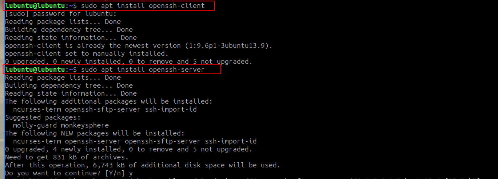
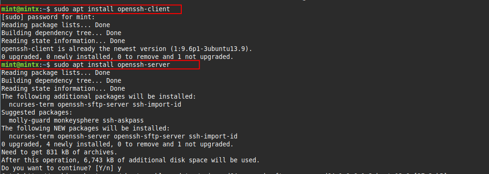
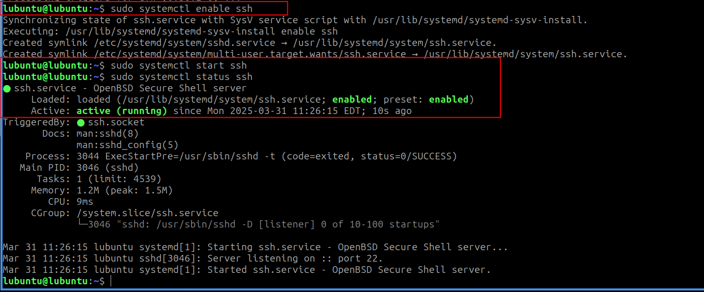
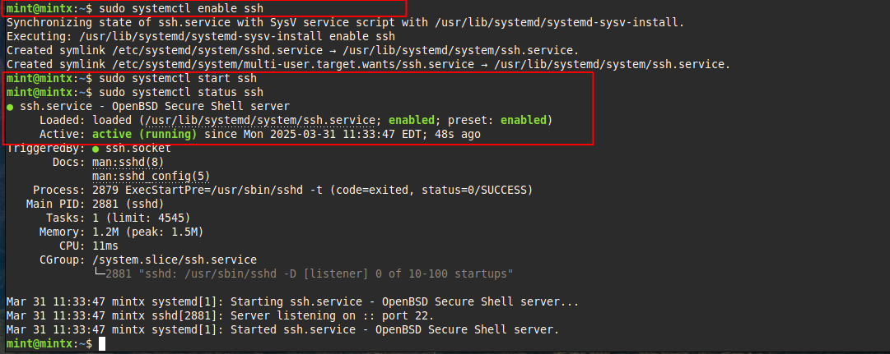
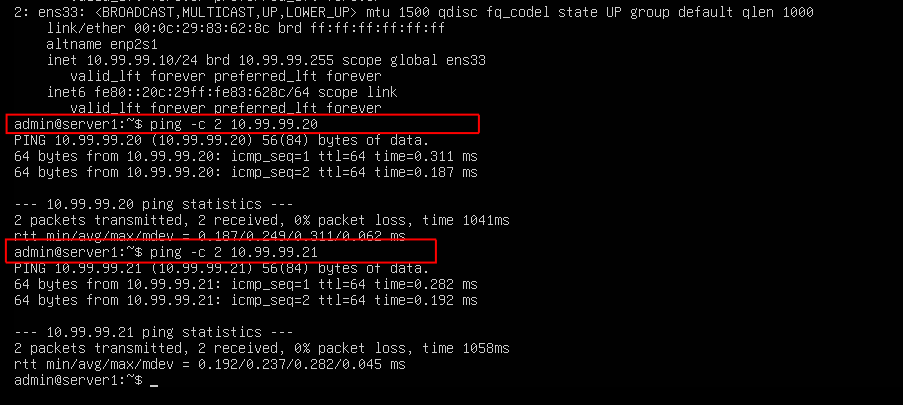
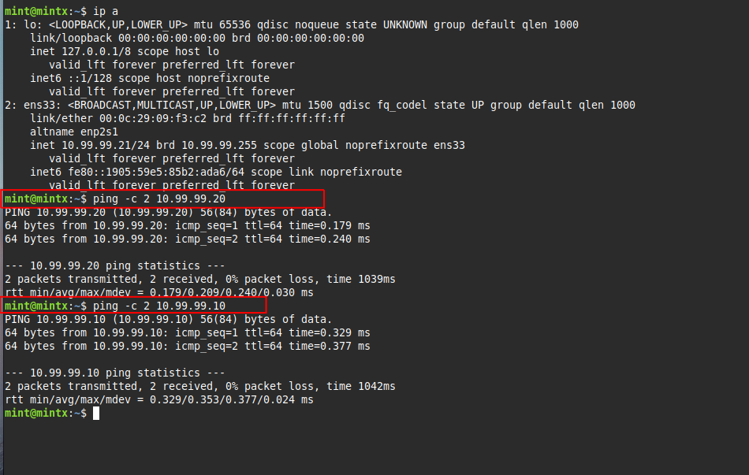
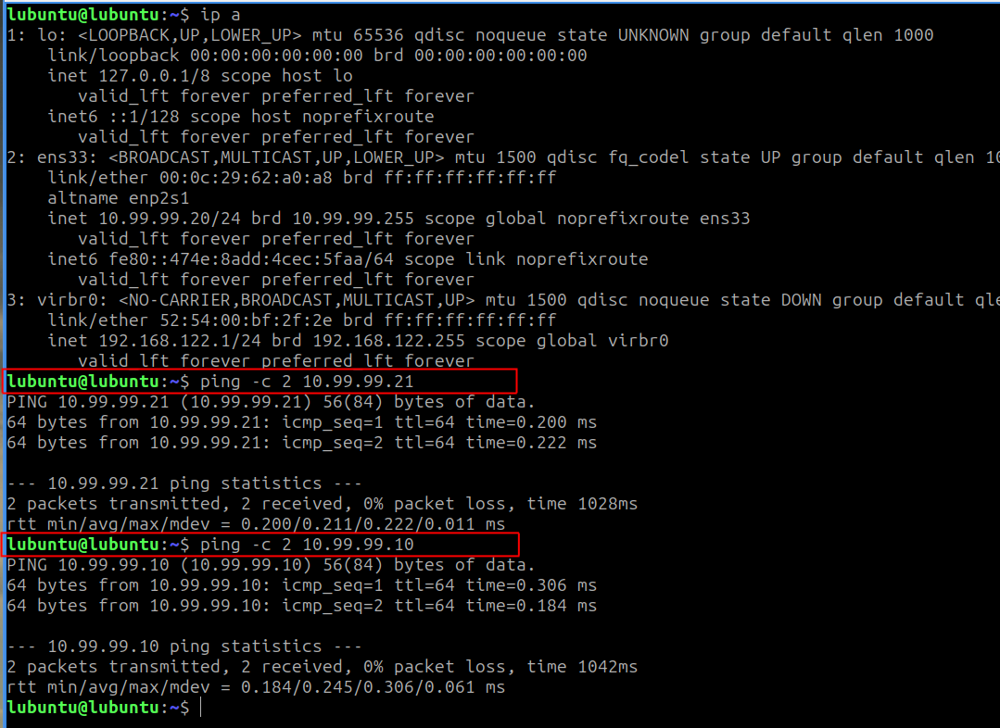

## Task 10 – Preparing Client Machines and Private Network Connectivity

In this task, I configured both client machines (Lubuntu and Mint) to:

1. Temporarily connect to the internet to install OpenSSH packages  
2. Enable and confirm SSH services  
3. Disconnect from the internet and rejoin the isolated lab network (vmnet99)  
4. Verify network connectivity between all three lab machines (Server1, Lubuntu, Mint)

This allows Server1 to securely access and manage both client systems within the closed environment.

---

### ⚙️ The What:

#### 🔌 Step 1: Temporary Internet Connection to Install SSH

On both **Lubuntu** and **Mint**, I installed:

- `openssh-client` – allows outbound SSH connections
- `openssh-server` – allows inbound SSH connections (i.e., for Server1 to SSH in)

```bash
sudo apt update
sudo apt install openssh-client openssh-server
```




---

#### 🟢 Step 2: Enable and Start SSH Service

After install, enable and confirm that SSH is up and running. Run this on both client machines.

```bash
sudo systemctl enable ssh
sudo systemctl start ssh
sudo systemctl status ssh
```




---

#### 🌐 Step 3: Move All Machines to Private Network (vmnet99) and Ping 'em

Reconnect all the VMs back to the private network, and ping all the machines to confirm connectivity.





---
