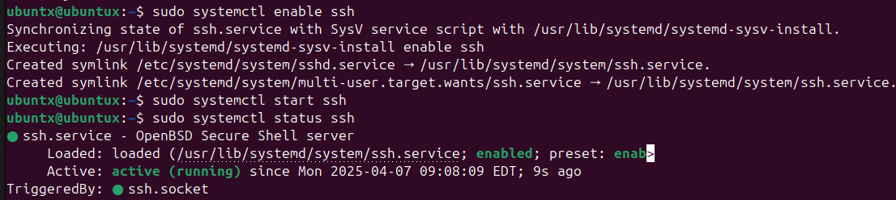
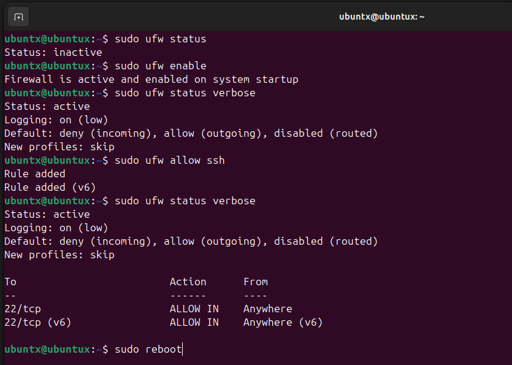
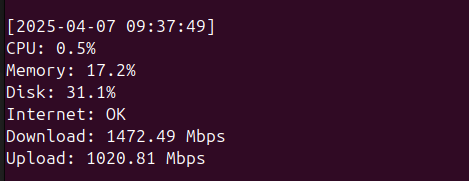
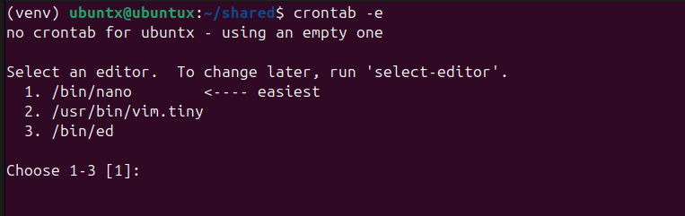
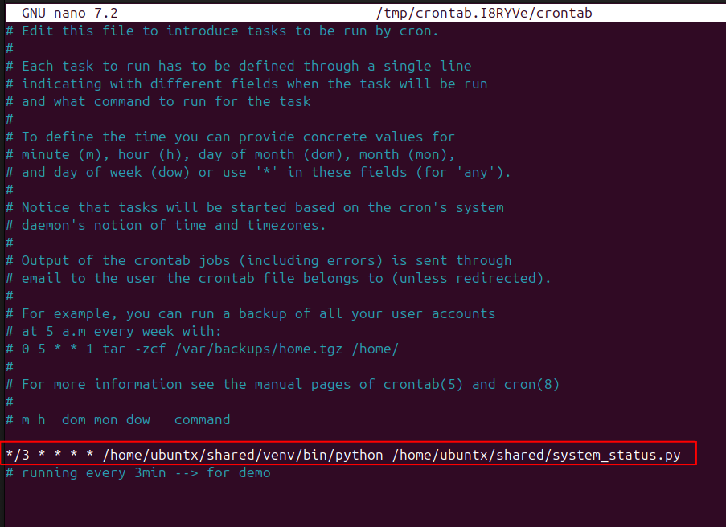
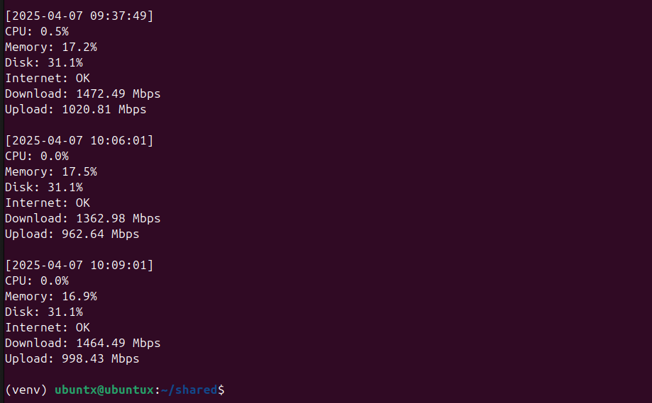

## Fun with Cron

---

### Goal

Create a system monitoring script using Python and schedule it with cron to run every 3 minutes. The script collects CPU, memory, and disk usage, checks for internet connectivity, and logs download/upload speed using speedtest-cli.
This project is designed to run on a VM inside VMware with Ubuntu 24.04, and demonstrates the basics of automation with cron, psutil, and Python scripting.

---

### Environment
- Ubuntu 24.04 VM (fresh install)
- Tools:
	- psutil --> for system stats
	- speedtest-cli --> for bandwidth check
	- cron --> for scheduling
	- scp --> secure copy using ssh to send the script from the host to the VM
---

### Initial Setup
*After the install/build of the VM (note: I am using VMware Workstation Pro for this lab)*


Run updates and upgrades as per usual on a new vm build
```bash
sudo apt update && sudo apt upgrade -y
```
Then check to make sure that vmware tools are installed
```bash
sudo apt install open-vm-tools open-vm-tools-desktop -y
```
Need to install the openssh-server function on the VM to allow communication
```bash
sudo apt install openssh-server -y
sudo systemctl enable ssh
sudo systemctl start ssh
sudo systemctl status ssh # confirm ssh is running
```


Check firewall (ufw) to make sure it's installed and enabled, then allow ssh as I am going to use scp(copy via ssh) to send the newly created python script to the VM for demonstration purposes even though VMware has an easy to use shared folder function.

```bash
sudo ufw status # either get 'inactive' or an error like Command 'ufw' not found --> if not found then ufe isn't installed
sudo apt install ufw # if needed
sudo ufw enable
sudo ufw allow ssh
sudo ufw status verbose
```



---

**Send the newly created system_status.py file to the VM from the host using ssh**
```bash
scp system_status.py youruser@<vm_ip>:/home/youruser/<destination folder>
```

**Test run of the script**


*Note: to get the script to run with speedtest it must be run in a virtual environment/sandbox. See the link below for an explanation.*
*Note: The try/except block was intentionally removed for testing clarity. And because it returns 0 for upload and download speed, and I'm not sure why.*

[venv explanation](https://packaging.python.org/en/latest/guides/installing-using-pip-and-virtual-environments/)


---

## Setting up Cron Schedule

*The first time you run crontab -e you might be asked to choose an editor, I use nano because right now that's the only one I know.*


 

## A short while later...


---

## Summary

In this lab, a Python script was created to monitor system performance and log key metrics including CPU load, memory usage, disk usage, and internet speed. The script was deployed to an Ubuntu VM, scheduled to run automatically with cron, and validated for functionality over time.

**Note:  The speedtest-cli module performed inconsistently inside the VM—returning 0 Mbps in some cases. After removing the try/except block for debugging, it worked as expected. This highlights how certain tools behave differently in virtualized or sandboxed environments and the importance of testing within context.**

---


