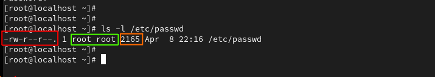
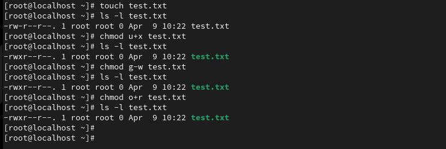
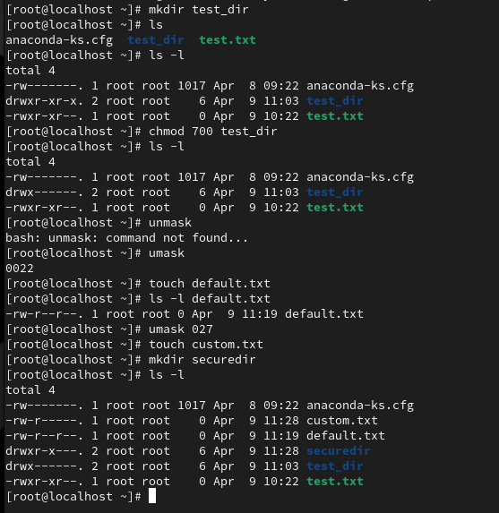
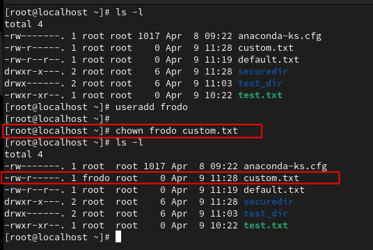
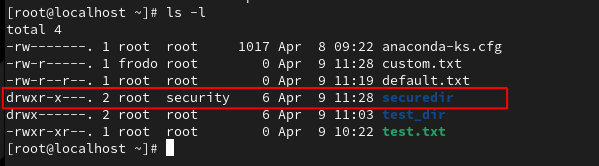

# File and Directory Permissions and Ownership

---

## Goal

This hands-on lab covers key Linux+ objectives around file and directory permissions and ownership on a Rocky Linux system. Each part is structured with detailed explanations, terminal commands, and practical tests, to not just perform tasks—but understand why they matter.

---

## Part 1  Files --> Permissions (chmod, symbolic and numeric)

**Why this matters**
Linux is a multi-user system. Knowing how to control who can read, write, or execute a file is foundational for everything from personal privacy to enterprise-grade access control. Mastering permissions prevents accidental exposure, protects sensitive data, and is crucial for securing shared systems.

**Note: for simplicity I'm running all the commands as the *root* user so I don't have to type *sudo* everytime**

---

**A quick look at current permissions**


- the red section highlights the type (in this case **-** indicates a file where a **d** indicates a directory)
- this is followed by 3 columns showing the permissions to the owner|group|others
- followed my the number of *hard links* in this case **1**
- the green section indicates the owner and group
- the orange sectiion is the file size in bytes
- the rest is self explanatory

---

### Practice *[chmod]* with Symbolic Mode

```bash
touch test.txt
ls -l test.txt
chmod u+x test.txt
ls -l test.txt
chmod g-w test.txt
ls -l test.txt
chmod o+r test.txt
```



- u+x --> [user] add executable permission
- g-w --> [group] remove write permission
- o+r --> [others] add read permission

---

### Practice *[chmod]* with Numeric Mode

| Numeric Value | Permission  | Explanation                                  |
|---------------|-------------|----------------------------------------------|
| 4             | Read (r)    | Allows the user/group/others to view the file's contents. |
| 2             | Write (w)   | Allows the user/group/others to modify the file's contents. |
| 1             | Execute (x) | Allows the user/group/others to run the file (if it's a program). |


```bash
chmod 754 test.txt
ls -l test.txt
```


---

## Part 2 Directories --> Permissions

Directory permissions in Linux (and other Unix-like systems) matter differently than file permissions because they control access to the directory itself and the ability to interact with its contents, rather than just the ability to read, write, or execute a single file.
- Directory permissions control actions on the *directory* itself
- File and directory permissions are set *individually*
- To apply changes to a directory recursively you need to use **-R** with **chmod**
- Incorrectly assigned permissions on a directory could allow a user to affect changes on the whole directory and its contents --> Example: deleting a directory

```bash
mkdir test_dir
ls -l
chmod 700 test_dir
ls -l
```

---

## Using [umask]

**What is *umask*?**
The umask (user file-creation mode mask) controls the default permission bits subtracted from new files and directories when they’re created. Understanding *umask* is critical for controlling default security behavior. Without it, newly created files or directories might be too open, especially in multi-user environments.

|Type	      |Base Permission	|Binary                             |
|Files	      |666 → rw-rw-rw-	|(No execute by default for safety) |
|Directories  |777 → rwxrwxrwx	|(Execute is needed to enter/search)|

**File Example**
```bash
umask # view the current defaults
touch default.txt 
ls -l default.txt
umask 027 # changing default permission on files and directories
touch custom.txt
mkdir securedir
ls -l
```



---

# Section 2 --> Ownership


Every file and directory in Linux is "owned" by a user and a group. These ownerships determine who can read, write, or execute that object based on its permissions.

This section shows how to:
- Check ownership
- Change ownership
- Change group ownership

---

**Viewing and changing ownership on a file**

```bash
ls -l
```
Changing ownership of a file on a new user. 
```bash
useradd frodo
chown frodo custom.txt
ls -l
```



---

**Changing Group ownership**

*Add a new group and assign ownership of a folder*

```bash
groupadd security
chgrp security securedir
ls -ld
```



**Setting both the owner and group in one line**

```bash
touch one_ring.txt
chown frodo:security one_ring.txt
ls -l
```


---

## Summary

In this part of the lab, we explored how Linux enforces file and directory access through permission bits and ownership attributes.
✅ Viewing and interpreting permission strings (ls -l)
✅ Modifying permissions using chmod (symbolic and numeric)
✅ Understanding and testing default permissions with umask
✅ Setting and changing file ownership with chown and chgrp

This hands-on section emphasizes the core security model of Linux systems: who owns a file, what group they belong to, and what actions they’re allowed to take. Mastery of these fundamentals is essential for securing multi-user environments, maintaining system integrity, and passing the CompTIA Linux+ exam.

All exercises were completed on a Rocky Linux VM, reflecting a real-world RHEL-based enterprise setup.

---
