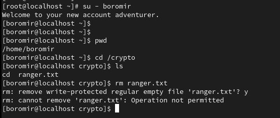

# Special Permissions, Attributes and Sticky Bits

---

## Goal

This lab focuses on learning special file permissions in Linux, which go beyond standard read/write/execute modes. In this section there will be:
- SUID (Set User ID)
- SGID (Set Group ID)
- Sticky Bit
- Immutable files
- Access Control Lists (ACLs)

**I'm using the *root* user here again for simplicity - add *sudo* to the commands if you don't have root access**

---

### Step 1 --> Create a simulated shared environment

```bash
mkdir /crypto
groupadd crypto
chown root:crypto /crypto
ls -ld /crypto
```


### Step 2: Set SGID(Set Group ID)

Why? SGID ensures all *new* file/folders created in the directory inherit the parent directory's group. Useful for a shared workspace. 

```bash 
chmod g+s /crypto
ls -ld /crypto # should now see an 's' in the permissions
```


**Now let's test to see if the group inheritance works**

```bash
useradd aragorn
usermod -aG crypto aragorn
su - aragorn
cd /crypto
touch ranger.txt
ls -l
```
*note if you get an error of permission denied when trying to create the file, you will have to switch back to the root user and change the group permissions so that members can also write files.*


---
## Attributes

### Sticky Bits

What is a sticky bit? Sticky bit lets users *write* to a shared directory but only delete *their own files.* Useful for /tmp, shared project folders, etc.


**Adding sticky bit protection on the directory**
```bash
chmod +t /crypto
ls -ld /crypto
```


- Create a new user and try to delete another users file (ranger.txt)

```bash
useradd boromir
usermod -ag crypto boromir
su - boromir
cd /crypto
rm ranger.txt 
```



---

### Immutable

What is *chattr*? chattr stands for "change attribute". It’s used to set extended file attributes on Linux filesystems like ext4. These are low-level filesystem controls that apply in addition to the usual chmod, chown, and permission bits.
The chattr +i command makes a file immutable, meaning it cannot be changed or deleted—even by the root user—until the flag is removed. This is useful for protecting sensitive or critical files from accidental or malicious modifications. It’s a powerful tool for system hardening and can override normal file permissions.

```bash
touch readme.txt
ls
chattr +i readme.txt
lsattr readme.txt
rm readme.txt
```


---

## Access Control Lists

**View existing ASLs**

```bash 
getfacl /crypto
```

Allow security group Read-only access
```bash
setfacl -m g:security:r /crypto
```


---

## Summary

In this part of the lab, we explored how to apply sticky bits, immutable attributes, and Access Control Lists (ACLs) to manage file-level security on shared directories.

Key concepts demonstrated:

    ✅ Sticky Bit: Ensures only file owners (or root) can delete files in a shared directory—common in locations like /tmp.
    ✅ Immutable Attribute (chattr +i): Locks a file against modifications, renaming, or deletion—even by root—until explicitly unlocked.
    ✅ Access Control Lists (ACLs): Allows for fine-tuned permission settings beyond traditional rwx, enabling group-specific access rules.

---

