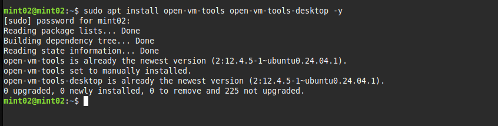
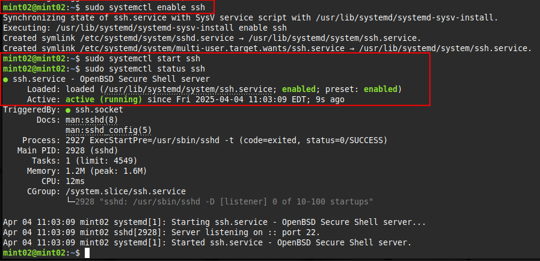
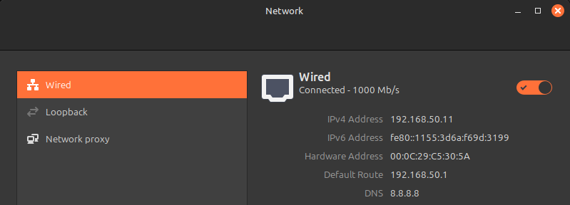
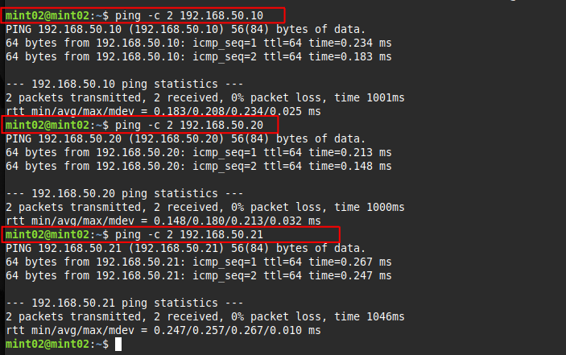

## Setup Log – SOHO Lab (Mint Devices)

Date: 2025-04-04

## Goal

Deploy two Linux Mint machines to function as the primary PCs in the SOHO lab environment. These will operate on the same internal network as the other devices and be fully SSH accessible for testing and simulation purposes.

---

## Device Setup Summary

- Two Mint VMs were created:
  - One for **Mint01**
  - One for **Mint02**
- These simulate standard home desktop computers in the lab.
- Devices are part of the internal network `vmnet99`.
- Each machine was configured with SSH, static IPs, and full updates.

---

## Installation Steps

### 1. Base Install
- Installed Mint VMs as normal using **NAT** mode for internet access during setup.
- Ran initial updates post-install:

```bash
sudo apt update && sudo apt upgrade -y
```

## VMware Tools (Pre-installed on Mint)
- While Mint comes with the tools pre-installed, installation was verified manually:
```bash
sudo apt install open-vm-tools open-vm-tools-desktop -y
```



## OpenSSH

- Install, enable and start up the SSH service:

```bash
sudo apt install openssh-server
sudo systemctl enable ssh
sudo systemctl start ssh
sudo systemctl status ssh 
sudo reboot
```



---

## Configure the Lab Network and Test Connectivity
- Once install is confirmed it's on to IP addressing for the Mint machines.
- Shut down the machine and from the Vmware settings, switch the network adapter from NAT to the preconfigured private adapter. (vmnet99 in this case)
```plaintext
Mint01 IP:  192.168.50.10
Mint02 IP:  192.168.50.11
Gateway:    192.168.50.1
DNS:        8.8.8.8
Subnet:     255.255.255.0
```



**I'm not showing all the outbound pings here but I did go to each machine to confirm that each could talk to all the others.**



---

**Now on to the last step of the set up, the lynch pin of this whole thing --> the server/router**

---


