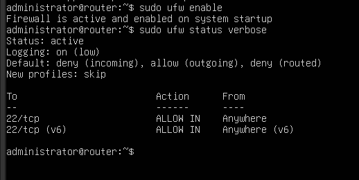

## Setting up the Router/Server (the good stuff)

Date: 2025-04-04

## Goal

Configure an Ubuntu Server VM to act as the central **router** for the SOHO lab. This system will:
- Route traffic between the internal lab network (`vmnet99`) and the external world (via NAT)
- Handle IP forwarding and NAT (masquerading)
- Optionally implement firewall rules and basic DNS/DHCP support
- Simulate a real-world home gateway setup using only open-source tools

---

### Base Install of the Server OS

- Using a standard Ubuntu Server ISO for the OS
- After the initial boot up, run the update/upgrade and install any extra packages that will be needed for the server to work as the router for this lab

```bash
sudo apt update && sudo apt upgrade -y 
```
---
## Tools

The OpenSSH was installed during the initial install --> still has to be enabled and started

```bash
sudo systemctl enable ssh
sudo systemctl start ssh
sudo systemctl status ssh
```


**Tools for this next part:**
- net-tools --> provides legacy tools like **ifconfig** 
- iptables-persistent --> allows saving of firewall/NAT rules across reboot
- ufw --> uncomplicated firewall to be enables and configured 

```bash
sudo apt install net-tools
sudo apt install iptables-persistent
sudo apt install ufw
```

## Adding a Second Network Adapter

**Just before shutting down the VM take note of the current interface setting**
```bash
ip a
```


Open the VM setting and add a second network adapter. Set this adapter to the same one used by the rest of the network (Mint01, Mint02, and the two wireless devices) --> in this case I'm using vmnet99
- Power up the Vm and check the settings again. *Note the adapter settings - this is needed shortly*


**Note: the second adapter is showing , but its in the DOWN state. Now to fix that**

Head over to the cd netplan folder to find the file that needs to be edited:
```bash
cd /etc/netplan
```
Open your chosen editor to make some changes to the configuration.


Then run:
```bash
sudo netplan apply
```


**Power up one of the other VMs to chek that the new gateway address is live and can be reached**


---

## Setting Up IP Forwarding

Open this file in your editor:
```bash
sudo nano /etc/sysctl.conf
```
Scroll to the line:
#net.1pv4.ip_forward=1
- uncomment the line to activate forwarding
- Save the file and exit
Apply the Change:
```bash
sudo sysctl -p 
```
You should see:
_net.ipv4.ip_forward = 1_

## Setting up NAT (Masquerading)
**This allows the devices reach the internet through the server/router**

```bash
sudo iptables -t nat -A POSTROUTING -o ens33 -j MASQUERADE
```
Replace ens33 with your external interface if different. 
Run this to save the setting across reboots:
```bash
sudo netfilter-persistent save
```
**Testing to make sure that the devices in the network can reach the internet and DNS is functioning**


---

## Final Step for this Lab --> Firewall(ufw)

- Default Deny ALL incoming traffic
- Allow ALL outgoing (devices need this for update/web access)
- Allow SSH


```bash
sudo ufw default deny incoming
sudo ufw default allow outgoing
sudo ufw allow ssh
sudo ufw enable
sudo ufw status verbose
```



---

## 🧾 Lab Summary

In this section of the SOHO lab, a virtual Ubuntu Server was transformed into a fully functional router and firewall. By configuring dual network adapters, enabling IP forwarding, and applying NAT rules, the server now routes traffic between the isolated internal lab network and the external internet. Key services like SSH and UFW were installed and secured, allowing for remote management and controlled access.

All client devices (Mint01, Mint02, Lubuntu printer, and phone) now successfully communicate through this router, simulating a realistic home gateway setup using only open-source tools. This lab demonstrates core networking concepts including interface management, routing, NAT, and firewall configuration on a Linux system — all fully documented and tested in a virtual environment.
