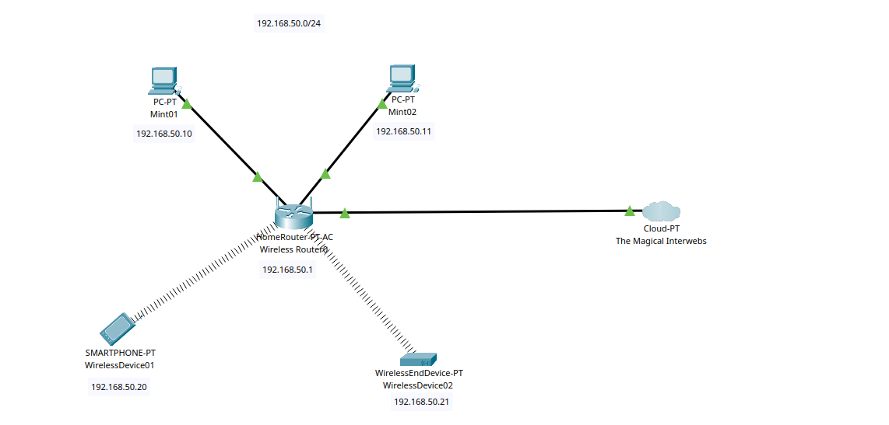

# SOHO Network Topology (Packet Tracer)

This topology represents the simulated layout of a Small Office/Home Office (SOHO) network, created in Cisco Packet Tracer to mirror the real-world setup being built in VMware.

---

## Purpose

This diagram is used to:
- Visually represent the logical flow of traffic between devices in a typical SOHO setup.
- Provide a reference point for the VMware-based implementation using Linux systems.
- Simulate wired and wireless connectivity using static IP addressing.

---

## Devices and IP Assignments

| Device Name         | Type                | IP Address      | Notes                     |
|---------------------|---------------------|------------------|---------------------------|
| Mint01              | PC (wired)          | 192.168.50.10    | Simulated Mint install    |
| Mint02              | PC (wired)          | 192.168.50.11    | Simulated Mint install    |
| WirelessDevice01    | Smartphone (wireless)| 192.168.50.20   | Simulated via Lubuntu |
| WirelessDevice02    | Printer (wireless)  | 192.168.50.21    | Simulated via Lubuntu     |
| Wireless Router0    | Home Router         | 192.168.50.1     | Default gateway           |
| The Magical Interwebs | Cloud              | N/A              | Represents internet access|

Subnet: `192.168.50.0/24`  
Gateway: `192.168.50.1`  
DNS: `8.8.8.8`  
All IPs are statically assigned.

---

## Notes

- **Router Simulation:** In the VMware lab, the router functionality will be handled by a Linux Ubuntu Server VM with dual NICs, IP forwarding, and NAT.
- **Wireless Simulation:** Lubuntu 'functionally headless (meaning minimized and controlled through SSH) Linux VMs are used to simulate mobile and printer devices for this lab.
- The cloud labeled *“The Magical Interwebs”* represents external connectivity and is not a functional part of the lab.

---

## Related

- See the `soho_lab` readme.md for the broad overview of this project.
- This diagram is for planning/documentation purposes only.
