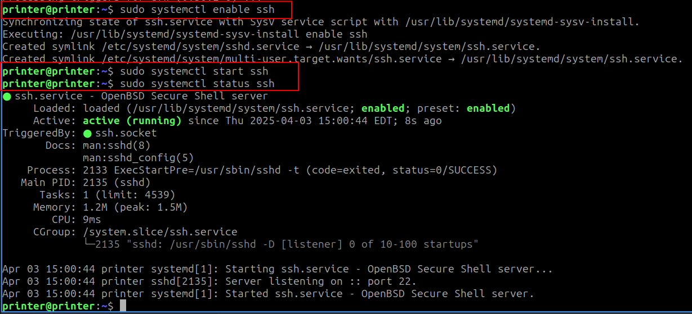
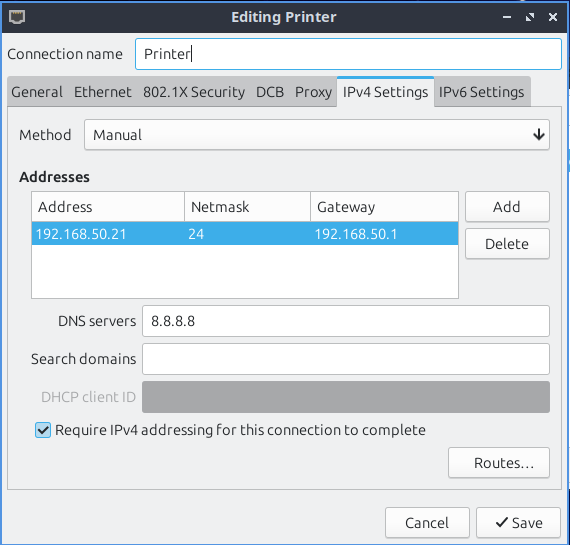

## Setup Log – SOHO Lab (Lubuntu Devices)

Date: 2025-04-03

## Goal

Simulate wireless devices (a phone and a printer) using lightweight Lubuntu VMs inside the SOHO lab. These will run *functionally headless* via SSH to conserve system resources.

---

## Device Setup Summary

- Two Lubuntu machines were created:
  - One to simulate a **wireless printer**
  - One to simulate a **wireless smartphone**
- Both were installed with GUI (default Lubuntu ISO) but will be accessed via SSH for resource efficiency.
- These devices are part of the internal network on `vmnet99`.

---

## Installation Steps

### 1. Base Install
- Installed Lubuntu VMs as normal
- Connected via NAT during installation to access internet

```bash
sudo apt update && sudo apt upgrade
```

---

### 2. VMware Tools (Optional but Included)

```bash
sudo apt install open-vm-tools open-vm-tools-desktop -y 
sudo reboot
```

> 💬 Note: Desktop tools were installed out of habit — not necessary for SSH-only use.

---

### 3. OpenSSH Server Setup

To allow remote access and simulate headless device behavior:

```bash
sudo apt install openssh-server
```

Then enable and start the service:

```bash
sudo systemctl enable ssh
sudo systemctl start ssh
sudo systemctl status ssh 
sudo reboot
```



---

### 4. Configure for Lab Network (vmnet99)

- Shut down the VM
- Changed the network adapter to `vmnet99` (private/internal)
- Booted back up and set a **static IP** via the network manager GUI:

```plaintext
Printer IP: 192.168.50.21
Phone IP:   192.168.50.20
Gateway:    192.168.50.1
DNS:        8.8.8.8
Subnet:     255.255.255.0
```



---

### 5. Second Wireless Device

- Repeated the above steps for the second Lubuntu VM (acting as smartphone)
- Assigned IP: `192.168.50.20`

---

✅ Both VMs are now:
- Running Lubuntu
- SSH accessible on the internal network
- Representing their intended wireless roles in the SOHO topology
