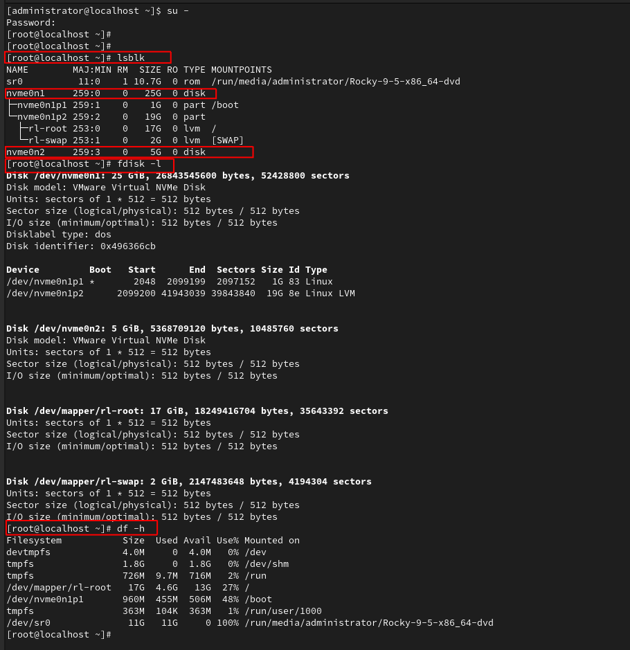
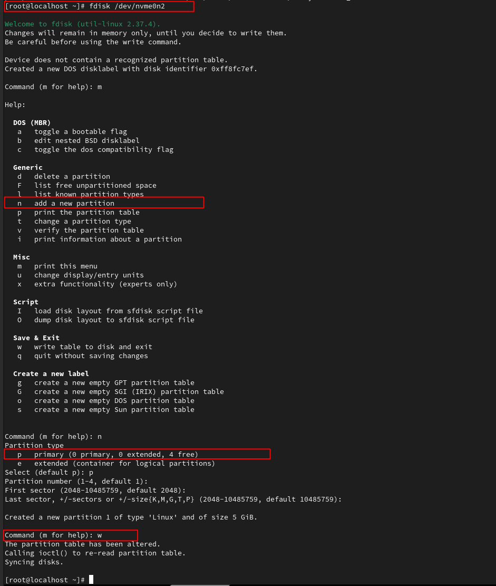
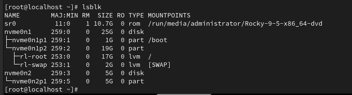
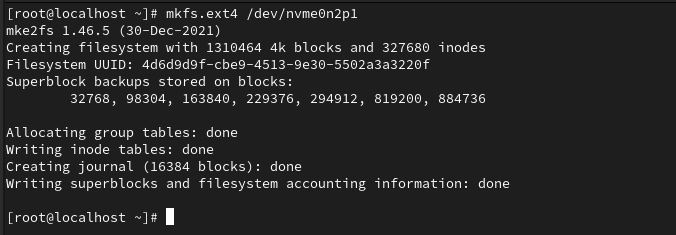
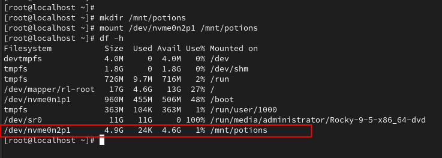

# Partition and Mounting Drives

---

## Goal 

This lab covers disk partitioning fundamentals in a real-world Rocky Linux environment. You'll create, format, and mount partitions using fdisk, mkfs, and mount, and learn how these steps relate to actual system setup and administration.
	- This lab also serves as a study aid for the CompTIA Linux+ exam and includes annotated commentary on why each command matters — not just how to run it.

---

## Lab Environment

Base system: Rocky Linux
Disk Configuration:
	- /dev/sda (25GB): primary 
	- /dev/sdb (5GB): added for this lab demo

---

### Step 1: Inspecting Existing Disk

**Why it matters:** Understanding the current disk and partition structure is the first thing a sysadmin should do before manipulating storage. It prevents data loss and shows what’s available to work with.

*I'm running all commands as the **root** user so I don't have to type **sudo** everytime.*

```bash
lsblk # lists the devices in a tree format
sudo fdisk -l # show partition details
df -h # displays current mounted file systems and usage
```



*Note: In the screenshot you see the drives labelled as /dev/nvme0n1 & /dev/nvme0n2 - this is because in this VM I am using nmve drives. If you are using SATA drives the output will look like: /dev/sdb --> or something similar*

---

### Step 2: Create a Partition and Mount the Disk

**Why this matters:** A disk without partitions can't be formatted or mounted --> in other words, it can't be used. 

```bash
sudo fdisk /dev/nmve0n2 # it's a really good idea to make sure you're formatting the correct drive
```

**Inside *fdisk* use these commands:**
	- **n** --> new partition
	- **p** --> primary
	- accept the next few defaults
	- **w** write changes and exit




---

### Step 3: Format the new Partition (ext4)

**Why it matters:** With the new partition done, it still can't be used until it's formatted. For this drive, we'll use *ext4* - a common use format for Linux systems. 

```bash
sudo mkfs.ext4 /dev/nvme0n2p1 # be sure to include the newly created partition
```



---

### Step 4: Mount the Drive

**Why it matters:** Now that the drive is partitioned and the partition formatted, it has to be made accessible. First make a new directory, and then mount the drive to that directory. After that, all files saved that directory will be save on the new drive. 

```bash
sudo mkdir /mnt/potions # new folder
sudo mount /dev/nvme0n2p1 /mnt/potions
df -h # confirm the wizardry
```



---

**Super important note: DO NOT try to create a new partition on a drive that is currently in use (ie the one your using right now) --> this can lead to chaos. 
If you need to make a partition on your main drive, then you need to boot into a live Linux USB Boot drive so that the drive you are trying to partition isn't in use.** 

---

## Summary

This lab displayed core Linux partitioning skills on a Rocky Linux system using a secondary virtual disk. Created a new partition with fdisk, formatted it using mkfs.ext4, and mounted it to a custom directory — making it accessible within the Linux filesystem.
This hands-on project reinforced essential Linux+ exam concepts around disk management, filesystem creation, and mounting — all while simulating the practical decisions a system administrator might face.
