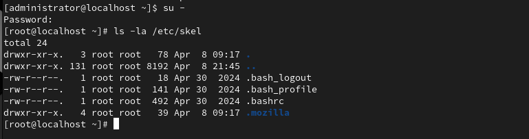
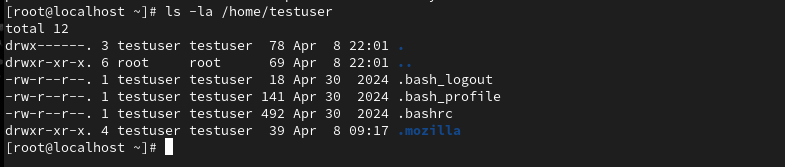
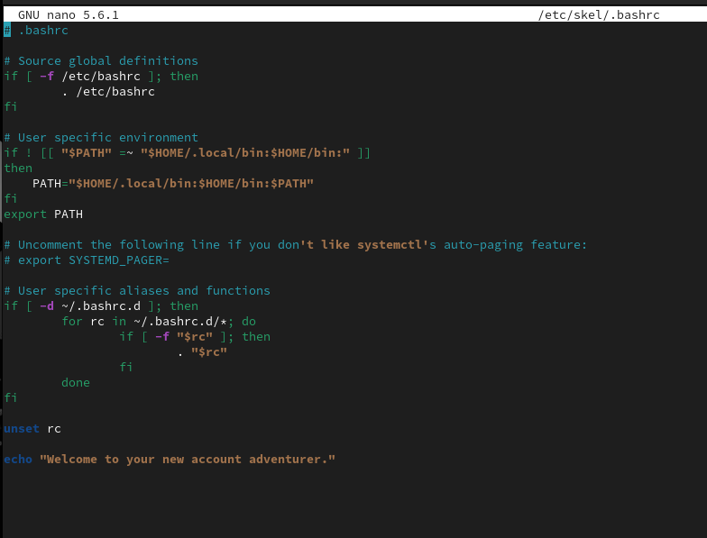
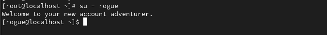
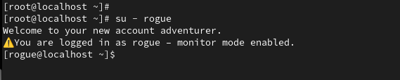
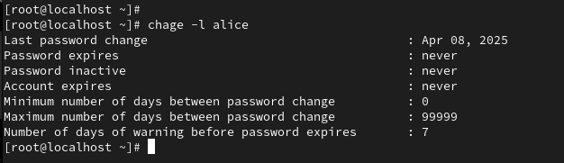
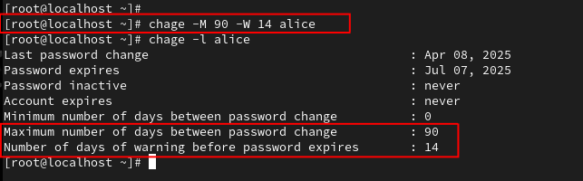
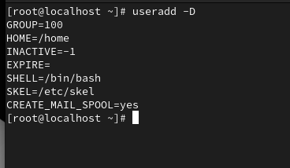

### Account Profiles

## Goal

This part of the lab focuses on understanding and managing the default settings applied to new user accounts. Instead of configuring each user from scratch, Linux uses default templates and skeleton files to ensure consistency and proper permissions. As a sysadmin (or exam candidate), knowing how these defaults work and how to customize them is a huge productivity booster and important for standardizing your environment.

---

**The /etc/skel folder**
*This folder's contents are copied into the /home/username/ whenever a new user is created*
```bash
ls -la /etc/skel
```



```bash
sudo useradd testuser
sudo passwd testuser
```
Then verify the home directory
```bash
ls -la /home/testuser
```



Same as the /etc/skel directory --> its a *template*

---

### Modify the Template

Sometimes you want every new user to have specific environment settings — aliases, default shell configs, banner messages, etc. Instead of setting these up one by one, we modify the default files in /etc/skel/, so they’re automatically applied to all future users.

Making a change the /etc/skel file will change the template for all *future* users. 
```bash
nano /etc/skel/.bashrc
```



### Testing the Change

Make a new user and see if the change was applied
```bash 
sudo useradd rogue
sudo passwd rogue
```
Switch to the new user
```bash
su - rogue
```



Or modify a *specific* user profile

```bash
sudo nano /home/rogue/.bashrc
```



---

### User Defaults

First view the user-specific defaults. 
This will show the password aging information for the specified user.
```bash
sudo chage -l alice
```

*[chage] - short for chang age - helps to manage expiration policies for passwords*



Modifying the policy for the user.

```bash
sudo chage -M 90 -W 14 alice
```
**[-M 90]** Password must be changed every 90 days
**[-W 14]** User gets a 14 day warning before password expires



---

### Default Account Settings

When a new user is created, Linux relies on default settings to control things like:
- Where the home directory is created
- What the default shell is 
- What files get copied to from /etc/skel

```bash
sudo useradd -D
```




### Default Login Settings

To view the defaul login settings:
```bash
cat /etc/login.defs
```

**Either of these files can be edited *carefully* with an editor like nano or vim when adjustments are needed**

---

## Summary

This phase explored how Linux manages user environments and login behaviors by examining key configuration files like /etc/skel, .bash_profile, .bashrc, and /etc/login.defs. You learned how default settings are applied to new users, how to customize a user’s shell experience, and how to view historical login activity.
This phase ties together user management and system policy, completing the lab with a deeper view into how Linux handles user sessions from creation to login and logout.


