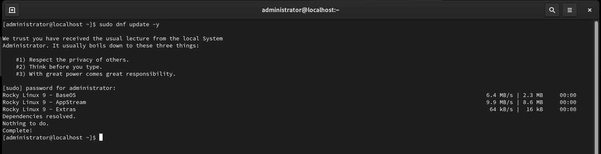
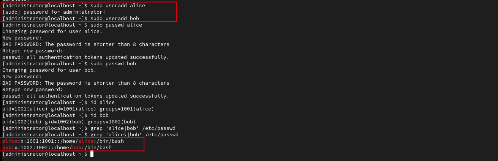
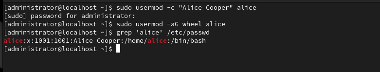
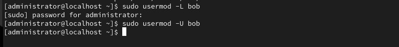
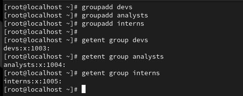
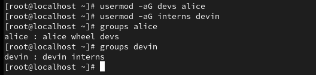
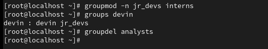

# Users & Groups - Creation, Deletion and Modification

---

## Goal

This lab walks through essential user and group administration tasks commonly performed by Linux system administrators. Whether you're preparing for the CompTIA Linux+ exam or building hands-on experience, this lab provides practical exposure to core concepts.
All tasks are performed on a Rocky Linux VM to simulate a real-world RHEL-based environment.
This lab focuses on:

    ✅ Managing user accounts (creation, password assignment, usermod, deletion)

    ✅ Managing groups (creation, assigning users, renaming, cleanup)

    ✅ Verifying system state after changes using CLI tools (id, groups, cat /etc/passwd, etc.)

---

**I am using a Rocky Linux machine for this lab as a way to 'study' and practice for the Linux + exam**

With the machine built and ready to go, the first step as always is to make sure that it's up to date.
```bash
sudo dnf update -y
```


---

# Users

## Creating Users

Adding new users and assigning the passwords
```bash
sudo useradd alice
sudo useradd bob
sudo passwd alice
sudo passwd bob
```


*You can see the error regarding the passwords because I used silly passwords here, in practice proper passwords should be applied* 

---

## Modify a User Account

*Seems like alice is really Alice Cooper*
*Giving alice sudo privileges*

```bash
sudo usermod -c "Alice Cooper" alice
sudo usermod -aG wheel alice
```



**Now to lock out bob, first day on the job and causing problems already**
```bash
sudo usermod -L bob
```
*Just a misunderstanding afterall*
```bash
sudo usermod -U bob
```


---

## Delete Users

*Poor bob...*
```bash
sudo userdel bob
sudo userdel -r bob # delete the home directory as well
```
---

# Groups

## Creating Groups

```bash
sudo groupadd devs
sudo groupadd analysts
sudo groupadd interns
```

*Did that work?*
```bash
getent group devs
getent group analysts
getent group interns
```


---

## Adding Users to Groups

*Can't have a group if no one is there*

```bash
sudo usermod -aG devs alice
sudo usermod -aG interns devin
```


---

## Modifying and Deleting Groups

Change a group's name
```bash
sudo groupmod -n jr_devs interns
```
Delete an unused group
```bash
sudo groupdel analysts
```



---
